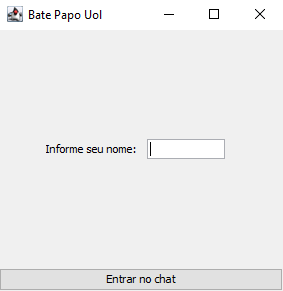
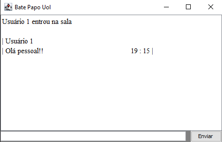
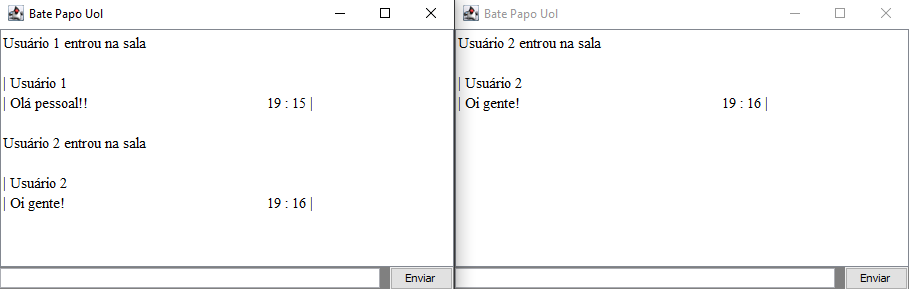
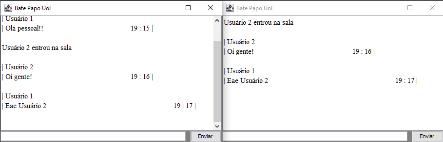

# Chat

## Sobre
Este projeto tem como finalidade implementação de um chat para apresentação de
um trabalho universitário.
Nele temos um chat simples para conversação de pessoas em uma rede local por
meio da comunicação de um servidro que integra a todos os clientes conectados
no momento. 

## Layout
 
 
 
 

## Tecnologia utilizadas
Foi utilizado apenas uma linguagem para desenvolvimento do trabalho solicitado,
como não foi solicitado nada que envolvesse um front-end. Linguagem utilizada:
 
 - Java;

## Como contribuir
Se você é um desenvolvedor com mais experiência, sempre tem algumas dicas para dar aos mais novos,
então no que puder acrescentar ao meu trabalho e ao meu crescimento como um desenvolvedor, estarei 
sempre de portas abertas para ouvir aos conselhos e ensinamentos que tiveram para dar!!

## Autor 
 - Caio Henrique Marques da Silva
 - LinkedIn: https://www.linkedin.com/in/caio-henrique-56b713200/
 - Instagram: caiohenrique3
